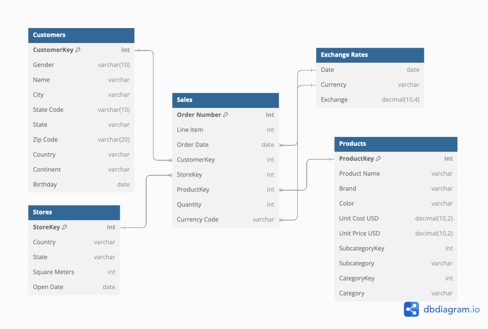
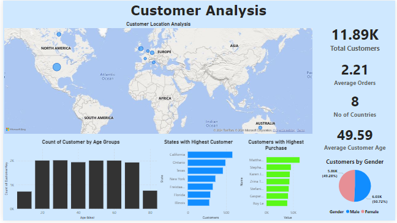
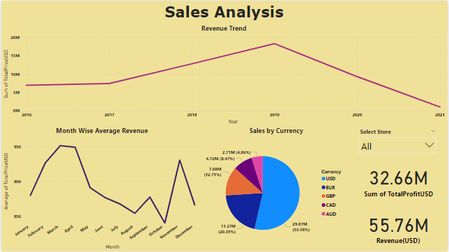
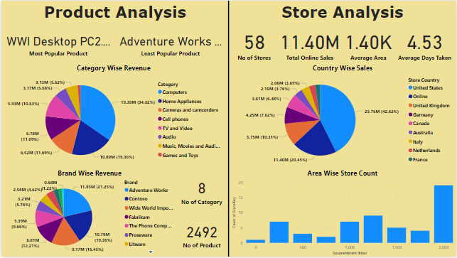

# DataSpark: Illuminating Insights for Global Electronics

DataSpark is a data-driven project designed to uncover insights from global electronics retail data. By leveraging data preprocessing techniques, this project makes it easy to gain meaningful insights to enhance business decisions.

## Getting Started

Follow these steps to set up and run DataSpark locally.

### Prerequisites

1. **Clone the Repository**  
   Download the repository to your local machine:
   ```bash
   git clone https://github.com/vikashgraja/DataSpark-EDA.git
   cd DataSpark-EDA
   ``` 

2. **Install Required Packages**  
   Install the necessary Python packages:
   ```bash
   pip install -r requirements.txt
   ``` 

###  Running the Project

1. **Open the Notebook**  
   Open data_preprocess.ipynb in your preferred Jupyter environment:
   ```bash
   jupyter notebook data_preprocess.ipynb
   ``` 
   
2. **Configure MySQL Credentials**  
   Update the MySQL credentials and database information in the notebook to match your setup:
   ```python
   mysql_server  = 'localhost'
   mysql_user = 'root'
   mysql_password = '1234567890'
   mysql_database = 'dataspark_database'
   ``` 
      ``` 
   
3. **Run the Cells**  
   Execute all cells in the notebook to begin data preprocessing and analysis.

### ER Diagram



###  PowerBI Dashboard

A PowerBI dashboard has been created using the GE_Data table from the dataspark_database as the data source. This dashboard visualizes key insights, including:

- Sales trends over time
- Store performance
- Customer segmentation





